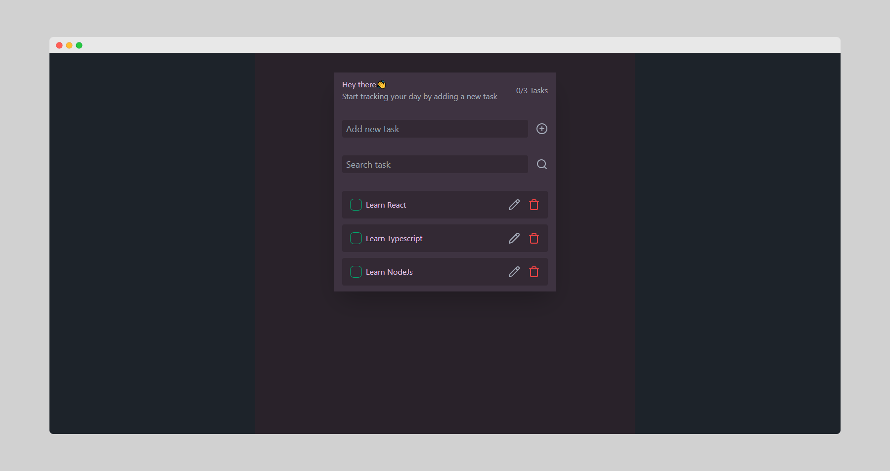

# Movie App



## Get Started

```bash
#First you need to clone this project
git clone https://github.com/Codeur-Omniscient/Todo-App

#Change directory
cd Todo-App

#Install dependencies
pnpm install
```

## Stack

- ReactJs
- Typescript
- TailwindCss
- Daisy Ui
- Framer Motion

## Feature

- Create Task
- Update Task
- Delete Task
- Search Task
- LocalStorage
<!--

## Deploy

This site is deployed on [Netlify](Netlify.com). You can preview by clicked [Here](https://tutorify-elearning.netlify.app/).

Don't forget to leave a star⭐ in the project if you like it😊

[](https://app.netlify.com/sites/tutorify-elearning/deploys) -->
